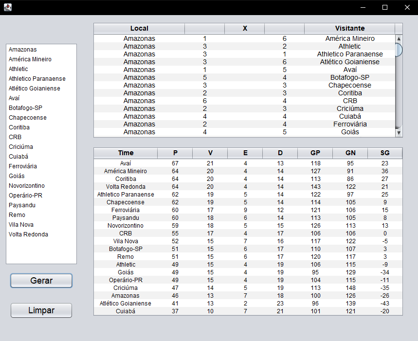

# Gerador de Tabela de Campeonato - Java Swing

## Sobre o Projeto

Este projeto é uma aplicação desktop desenvolvida em Java com a biblioteca gráfica Swing. O software simula um campeonato de futebol, gerando automaticamente todas as partidas no formato "todos contra todos" e, com base em resultados aleatórios, calcula e exibe a tabela de classificação final.

A aplicação foi criada como uma atividade avaliativa para a disciplina de **Algoritmos**, com o objetivo de aplicar conceitos de Programação Orientada a Objetos, manipulação de componentes GUI e lógica de processamento de dados.

## Funcionalidades Principais

- **Geração Automática de Partidas:** Cria todos os confrontos de um campeonato a partir de uma lista de times pré-definida.
- **Simulação de Resultados:** Atribui placares aleatórios para cada partida gerada, simulando o resultado de um campeonato completo.
- **Cálculo da Tabela de Classificação:** Processa os resultados de todas as partidas para montar a tabela final, calculando os pontos e outras estatísticas de cada time.
- **Exibição Detalhada da Tabela:** A classificação final exibe:
    - **P:** Pontos
    - **V:** Vitórias
    - **E:** Empates
    - **D:** Derrotas
    - **GP:** Gols Pró (Gols Marcados)
    - **GC:** Gols Contra (Gols Sofridos)
    - **SG:** Saldo de Gols

## Tecnologias Utilizadas

- **Linguagem:** Java
- **Interface Gráfica (GUI):** Java Swing
- **IDE de Desenvolvimento:** Apache NetBeans

## Screenshot da Aplicação

## Autor

- **Renan Manoel Lemes**
